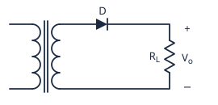
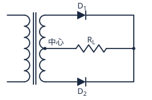
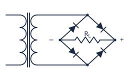

# 電子學表格必背

> 照老師發的填空紙整理：**5 張表、共 96 格**，欄位和列的順序都跟紙上一樣。
>
> 互動練習版（可以遮住、點格子對答案）：打開 [表格必背.html](表格必背.html)

## 目錄

1. [基本波形](#1-基本波形)
2. [整流電路](#2-整流電路)
3. [整流濾波電路](#3-整流濾波電路)
4. [電晶體放大組態](#4-電晶體放大組態)
5. [電晶體工作模式](#5-電晶體工作模式)

---

## 1. 基本波形

*Ch1・12 格*

| 波型種類 | 最大值 | 有效值 | 平均值 | 波峰因數 | 波形因數 |
|---|---|---|---|---|---|
| **方波** | Vm | Vm | Vm | 1 | 1 |
| **正弦波** | Vm | Vm/√2（0.707Vm） | 2Vm/π（0.636Vm） | √2（≈ 1.414） | π/2√2（≈ 1.11） |
| **三角波** | Vm | Vm/√3（0.577Vm） | Vm/2（0.5Vm） | √3（≈ 1.732） | 2/√3（≈ 1.155） |

**怎麼記**

- ⚠️ 這張的順序是「**方波、正弦波、三角波**」，跟課本（正弦在前）不一樣，填的時候看清楚列名。
- **方波整排最簡單**：有效值、平均值都是 Vm，兩個因數都是 1。
- 有效值的分母照順序是 **1、√2、√3**；平均值是 **Vm、2Vm/π、Vm/2**。
- **波峰因數 = 最大值 ÷ 有效值** = 有效值的分母：**1、√2、√3**（1、1.414、1.732）。
- **波形因數 = 有效值 ÷ 平均值**：**1、1.11、1.155**，跟著三角波越來越大。

---

## 2. 整流電路

*Ch2・24 格*

| 電路類型 | 電路 | 二極體數量 | PIV | 頻率 | Vo(rms) | Vo(av) | 漣波百分比 | 漣波值 |
|---|---|---|---|---|---|---|---|---|
| **半波整流** |  | 1 個 | Vm | fi | Vm/2（0.5Vm） | Vm/π（0.318Vm） | 121% | 0.385Vm |
| **中心抽頭** |  | 2 個 | 2Vm | 2fi | Vm/√2（0.707Vm） | 2Vm/π（0.636Vm） | 48% | 0.308Vm |
| **橋式** |  | 4 個 | Vm | 2fi | Vm/√2（0.707Vm） | 2Vm/π（0.636Vm） | 48% | 0.308Vm |

**怎麼記**

- **電路怎麼畫**：半波是一顆二極體串 RL；中心抽頭要畫**有中心抽頭的變壓器**，兩顆二極體陰極接在一起，RL 接回中心抽頭；橋式是四顆二極體排成菱形，**對邊方向一致**，RL 接在另外兩個角。
- 二極體數量 **1、2、4**；PIV 只有**中心抽頭是 2Vm**，其他都是 Vm。
- 兩種全波只差「電路、數量、PIV」，後面五格完全一樣。
- 全波是半波的兩倍：頻率 fi → 2fi、平均值 Vm/π → 2Vm/π。
- **漣波值**就是漣波有效值 Vr(rms)：半波 **0.385Vm**、全波 **0.308Vm**。漣波百分比 = 漣波值 ÷ 平均值：0.385/0.318 ≈ **121%**、0.308/0.636 ≈ **48%**。

---

## 3. 整流濾波電路

*Ch2・12 格*

| 電路類型 | PIV | 頻率 | 漣波因數 | 輸出平均值 |
|---|---|---|---|---|
| **半波濾波** | 2Vm | fi | 1/(2√3 RLCfi)（60 Hz：0.0048/(RLC)） | Vm − Vr(p-p)/2（= Vm − Idc/(2Cfi)） |
| **中心抽頭** | 2Vm | 2fi | 1/(4√3 RLCfi)（60 Hz：0.0024/(RLC)） | Vm − Vr(p-p)/2（= Vm − Idc/(4Cfi)） |
| **橋式** | Vm | 2fi | 1/(4√3 RLCfi)（60 Hz：0.0024/(RLC)） | Vm − Vr(p-p)/2（= Vm − Idc/(4Cfi)） |

**怎麼記**

- 加了電容以後，**半波的 PIV 從 Vm 變 2Vm**；中心抽頭還是 2Vm，**只剩橋式是 Vm**。
- 頻率跟整流一樣：半波 fi、全波 2fi。
- 漣波因數分母：半波 **2√3**、全波 **4√3**（因為 fo = 2fi）；60 Hz 時是 **0.0048、0.0024**（RL 用 Ω、C 用 F；用 kΩ、μF 就是 4.8、2.4）。
- 輸出平均值：**Vdc = Vm − Vr(p-p)/2**。把 Vr(p-p) = Idc/(Cfo) 代進去就是下面那行；**負載開路時 Vdc = Vm**。

---

## 4. 電晶體放大組態

*Ch3・30 格*

| 工作組態 | 輸入端 | 共用端 | 輸出端 | 功率增益 | 電流增益 | 電壓增益 | 輸入阻抗 | 輸出阻抗 | 相位 | 電路應用 |
|---|---|---|---|---|---|---|---|---|---|---|
| **CB** | E 極 | B 極 | C 極 | 中 | 最低（α ≈ 1（< 1）） | 高 | 最低 | 最高 | 同相（0°） | 高頻放大（阻抗匹配（低→高）） |
| **CE** | B 極 | E 極 | C 極 | 最高 | 高（β） | 高 | 中 | 中 | 反相（180°） | 一般放大（最常用（聲頻放大）） |
| **CC** | B 極 | C 極 | E 極 | 最低 | 最高（γ = 1 + β） | 最低（≈ 1（< 1）） | 最高 | 最低 | 同相（0°） | 射極隨耦器（緩衝、阻抗匹配（高→低）） |

**怎麼記**

- **共用端 = 名字第二個字母**；剩下兩極照「**C 不能輸入、B 不能輸出**」排：CB 是 E 入 C 出、CE 是 B 入 C 出、CC 是 B 入 E 出。
- **CE 是「全能型」**：電流、電壓增益都高，功率增益最高；阻抗都是中；**只有 CE 反相**；用在一般放大。
- **CB 和 CC 剛好相反**：CB 電流 ≈ 1、電壓高、輸入阻抗最低、輸出阻抗最高；CC 電流最高、電壓 ≈ 1、輸入阻抗最高、輸出阻抗最低。
- 應用：CB 高頻放大；CE 一般放大；CC 叫**射極隨耦器**，當緩衝器。
- ⚠️ 課本「本章摘要」只有前四欄。功率增益之後是常見的整理（大小用「高、中、低」寫），**以老師上課講的寫法為準**。

---

## 5. 電晶體工作模式

*Ch3・18 格*

| 工作模式 | B-C 接面 | B-E 接面 | NPN VBE | NPN VCE | PNP VBE | PNP VCE |
|---|---|---|---|---|---|---|
| **順向** | 逆向偏壓 | 順向偏壓 | 正（≈ 0.7 V） | 正（> 0.2 V） | 負（≈ −0.7 V） | 負（< −0.2 V） |
| **飽和** | 順向偏壓 | 順向偏壓 | 正（≈ 0.7 V） | 正（≈ 0.2 V） | 負（≈ −0.7 V） | 負（≈ −0.2 V） |
| **截止** | 逆向偏壓 | 逆向偏壓 | 負（< 0（逆偏）） | 正（≈ VCC） | 正（> 0（逆偏）） | 負（≈ −VCC） |

**怎麼記**

- ⚠️ **B-C 在前、B-E 在後**：順向主動填「**逆、順**」，飽和「**順、順**」，截止「**逆、逆**」。
- 電壓正負從課本的大小順序推：NPN 順向 **C &gt; B &gt; E**、飽和 **B &gt; C &gt; E** → VBE、VCE 都正；截止 **C &gt; E &gt; B** → VBE 負、VCE 正。
- **PNP 把 NPN 那兩欄的正負全部倒過來**（數字前面加負號）。
- **順向和飽和的差別在 VCE**：順向 VCE &gt; 0.2 V；飽和 VCE = VCE(sat) ≈ **0.2 V**（C-E 像短路）。VBE 都是 0.7 V 左右（飽和有些題目給 VBE(sat) = 0.8 V）。
- 截止時沒有電流，電阻上沒壓降，所以 **VCE ≈ VCC**（PNP 是 −VCC）；VBE 逆偏（實際上 VBE &lt; 0.7 V 就截止）。

---

## 空白練習表（可以印出來自己填）

### 1. 基本波形

| 波型種類 | 最大值 | 有效值 | 平均值 | 波峰因數 | 波形因數 |
|---|---|---|---|---|---|
| **方波** | Vm | 　　　 | 　　　 | 　　　 | 　　　 |
| **正弦波** | Vm | 　　　 | 　　　 | 　　　 | 　　　 |
| **三角波** | Vm | 　　　 | 　　　 | 　　　 | 　　　 |

### 2. 整流電路

| 電路類型 | 電路 | 二極體數量 | PIV | 頻率 | Vo(rms) | Vo(av) | 漣波百分比 | 漣波值 |
|---|---|---|---|---|---|---|---|---|
| **半波整流** | 　　　 | 　　　 | 　　　 | 　　　 | 　　　 | 　　　 | 　　　 | 　　　 |
| **中心抽頭** | 　　　 | 　　　 | 　　　 | 　　　 | 　　　 | 　　　 | 　　　 | 　　　 |
| **橋式** | 　　　 | 　　　 | 　　　 | 　　　 | 　　　 | 　　　 | 　　　 | 　　　 |

### 3. 整流濾波電路

| 電路類型 | PIV | 頻率 | 漣波因數 | 輸出平均值 |
|---|---|---|---|---|
| **半波濾波** | 　　　 | 　　　 | 　　　 | 　　　 |
| **中心抽頭** | 　　　 | 　　　 | 　　　 | 　　　 |
| **橋式** | 　　　 | 　　　 | 　　　 | 　　　 |

### 4. 電晶體放大組態

| 工作組態 | 輸入端 | 共用端 | 輸出端 | 功率增益 | 電流增益 | 電壓增益 | 輸入阻抗 | 輸出阻抗 | 相位 | 電路應用 |
|---|---|---|---|---|---|---|---|---|---|---|
| **CB** | 　　　 | 　　　 | 　　　 | 　　　 | 　　　 | 　　　 | 　　　 | 　　　 | 　　　 | 　　　 |
| **CE** | 　　　 | 　　　 | 　　　 | 　　　 | 　　　 | 　　　 | 　　　 | 　　　 | 　　　 | 　　　 |
| **CC** | 　　　 | 　　　 | 　　　 | 　　　 | 　　　 | 　　　 | 　　　 | 　　　 | 　　　 | 　　　 |

### 5. 電晶體工作模式

| 工作模式 | B-C 接面 | B-E 接面 | NPN VBE | NPN VCE | PNP VBE | PNP VCE |
|---|---|---|---|---|---|---|
| **順向** | 　　　 | 　　　 | 　　　 | 　　　 | 　　　 | 　　　 |
| **飽和** | 　　　 | 　　　 | 　　　 | 　　　 | 　　　 | 　　　 |
| **截止** | 　　　 | 　　　 | 　　　 | 　　　 | 　　　 | 　　　 |
