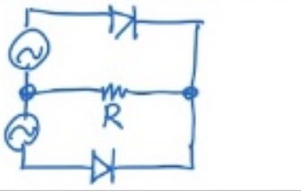
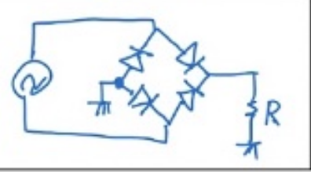
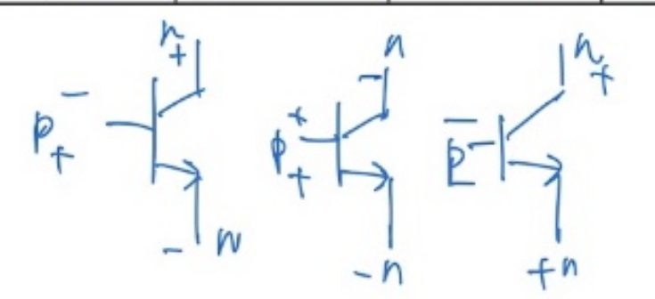

# 電子學表格必背

> 答案照**老師發的正確答案**整理：**5 張表、共 96 格**，欄位和列的順序都跟紙上一樣。
>
> 互動練習版（可以遮住、點格子對答案）：打開 [表格必背.html](表格必背.html)

## 目錄

1. [基本波形](#1-基本波形)
2. [整流電路](#2-整流電路)
3. [整流濾波電路](#3-整流濾波電路)
4. [電晶體放大組態](#4-電晶體放大組態)
5. [電晶體工作模式](#5-電晶體工作模式)

---

## 1. 基本波形

*Ch1・12 格*

| 波型種類 | 最大值 | 有效值 | 平均值 | 波峰因數 | 波形因數 |
|---|---|---|---|---|---|
| **方波** | Vm | Vm | Vm | 1 | 1 |
| **正弦波** | Vm | 1/√2 Vm | 2/π Vm | √2 | 1.11 |
| **三角波** | Vm | 1/√3 Vm | 1/2 Vm | √3 | 1.15 |

**怎麼記**

- ⚠️ 紙上的順序是「**方波、正弦波、三角波**」，跟課本（正弦在前）不一樣。
- **方波整排最簡單**：有效值、平均值都是 Vm，兩個因數都是 1。
- 有效值的分母照順序是 **1、√2、√3**，波峰因數剛好也是 **1、√2、√3**（波峰因數 = 最大值 ÷ 有效值）。
- 平均值：**Vm、2/π Vm、1/2 Vm**。
- 波形因數 = 有效值 ÷ 平均值：**1、1.11、1.15**，越來越大。

---

## 2. 整流電路

*Ch2・24 格*

| 電路類型 | 電路 | 二極體數量 | PIV | 頻率 | Vo(rms) | Vo(av) | 漣波百分比 | 漣波值 |
|---|---|---|---|---|---|---|---|---|
| **半波整流** |  | 1 | Vm | f | 1/2 Vm | 1/π Vm | 121% | 1.21 |
| **中心抽頭** |  | 2 | 2Vm | 2f | 1/√2 Vm | 2/π Vm | 48% | 0.48 |
| **橋式** |  | 4 | Vm | 2f | 1/√2 Vm | 2/π Vm | 48% | 0.48 |

**怎麼記**

- **電路**（照老師的畫法）：半波是交流電源 → 一顆二極體 → R；中心抽頭畫**兩個交流電源串起來**，中間那點接 R，上下各一顆二極體接到 R 的另一端；橋式是交流電源接四顆二極體排成的菱形，R 接在菱形另一邊。
- 二極體數量 **1、2、4**；PIV 只有**中心抽頭是 2Vm**，其他都是 Vm。
- 頻率：半波 **f**、全波 **2f**。
- Vo(rms)：半波 **1/2 Vm**、全波 **1/√2 Vm**；Vo(av)：半波 **1/π Vm**、全波 **2/π Vm**。
- **漣波百分比和漣波值是同一個數字的兩種寫法**：121% ↔ 1.21、48% ↔ 0.48。
- 兩種全波只差「電路、數量、PIV」，後面五格一樣。

---

## 3. 整流濾波電路

*Ch2・12 格*

| 電路類型 | PIV | 頻率 | 漣波因數 | 輸出平均值 |
|---|---|---|---|---|
| **半波濾波** | 2Vm | f | 1/(2√3 RLCf) | Vm − VD − Vrp |
| **中心抽頭** | 2Vm | 2f | 1/(4√3 RLCf) | Vm − VD − Vrp |
| **橋式** | Vm | 2f | 1/(4√3 RLCf) | Vm − 2VD − Vrp |

**怎麼記**

- 加了電容以後，**半波的 PIV 從 Vm 變 2Vm**；中心抽頭還是 2Vm，**只剩橋式是 Vm**。
- 頻率跟整流一樣：半波 **f**、全波 **2f**。
- 漣波因數分母：半波 **2√3** RLCf、全波 **4√3** RLCf（全波頻率加倍，所以分母加倍）。
- 輸出平均值：**Vm 扣掉二極體壓降 VD，再扣 Vrp**。**橋式扣 2VD**，因為電流每次會經過兩顆二極體；半波和中心抽頭每次只經過一顆。

---

## 4. 電晶體放大組態

*Ch3・30 格*

| 工作組態 | 輸入端 | 共用端 | 輸出端 | 功率增益 | 電流增益 | 電壓增益 | 輸入阻抗 | 輸出阻抗 | 相位 | 電路應用 |
|---|---|---|---|---|---|---|---|---|---|---|
| **CB** | E | B | C | 小 | 小 | 大 | 小 | 大 | 同 | 高頻放大 |
| **CE** | B | E | C | 大 | 中 | 中 | 中 | 中 | 反 | 訊號放大 |
| **CC** | B | C | E | 小 | 大 | 小 | 大 | 小 | 同 | 阻抗匹配 |

**怎麼記**

- **共用端 = 名字第二個字母**；剩下兩極照「**C 不能輸入、B 不能輸出**」排：CB 是 E 入 C 出、CE 是 B 入 C 出、CC 是 B 入 E 出。
- **CE 全部都是「中」**，只有功率增益是**大**，相位是**反**；應用：訊號放大。
- **CB 和 CC 剛好相反**（功率增益都是小、相位都是同）：
- CB：電流**小**、電壓**大**、輸入阻抗**小**、輸出阻抗**大**（小大小大）→ 高頻放大。
- CC：電流**大**、電壓**小**、輸入阻抗**大**、輸出阻抗**小**（大小大小）→ 阻抗匹配。

---

## 5. 電晶體工作模式

*Ch3・18 格*

| 工作模式 | B-C 接面 | B-E 接面 | NPN VBE | NPN VCE | PNP VBE | PNP VCE |
|---|---|---|---|---|---|---|
| **順向** NPN：VC > VB > VE PNP：VC < VB < VE | 逆 | 順 | VBE > 0 | VCE > 0 | VBE < 0 | VCE < 0 |
| **飽和** NPN：VB > VC > VE PNP：VB < VC < VE | 順 | 順 | VBE > 0 | VCE > 0 | VBE < 0 | VCE < 0 |
| **截止** NPN：VC > VE > VB PNP：VC < VE < VB | 逆 | 逆 | VBE < 0 | VCE > 0 | VBE > 0 | VCE < 0 |

*老師在表格下面畫的三顆電晶體（照順向、飽和、截止的順序），標出 P、N 和正負*

**怎麼記**

- ⚠️ **B-C 在前、B-E 在後**：順向「**逆、順**」、飽和「**順、順**」、截止「**逆、逆**」。
- 老師在每一列上面寫了電壓大小順序（列名下面的小字），**VBE、VCE 的正負就從這個順序看出來**。
- NPN：順向、飽和都是 **VBE &gt; 0、VCE &gt; 0**；只有截止 **VBE &lt; 0**（VCE 還是 &gt; 0）。
- **PNP 把 NPN 的 &gt; 和 &lt; 全部倒過來**，大小順序也是把 &gt; 換成 &lt;。

---

## 空白練習表（可以印出來自己填）

### 1. 基本波形

| 波型種類 | 最大值 | 有效值 | 平均值 | 波峰因數 | 波形因數 |
|---|---|---|---|---|---|
| **方波** | Vm | 　　　 | 　　　 | 　　　 | 　　　 |
| **正弦波** | Vm | 　　　 | 　　　 | 　　　 | 　　　 |
| **三角波** | Vm | 　　　 | 　　　 | 　　　 | 　　　 |

### 2. 整流電路

| 電路類型 | 電路 | 二極體數量 | PIV | 頻率 | Vo(rms) | Vo(av) | 漣波百分比 | 漣波值 |
|---|---|---|---|---|---|---|---|---|
| **半波整流** | 　　　 | 　　　 | 　　　 | 　　　 | 　　　 | 　　　 | 　　　 | 　　　 |
| **中心抽頭** | 　　　 | 　　　 | 　　　 | 　　　 | 　　　 | 　　　 | 　　　 | 　　　 |
| **橋式** | 　　　 | 　　　 | 　　　 | 　　　 | 　　　 | 　　　 | 　　　 | 　　　 |

### 3. 整流濾波電路

| 電路類型 | PIV | 頻率 | 漣波因數 | 輸出平均值 |
|---|---|---|---|---|
| **半波濾波** | 　　　 | 　　　 | 　　　 | 　　　 |
| **中心抽頭** | 　　　 | 　　　 | 　　　 | 　　　 |
| **橋式** | 　　　 | 　　　 | 　　　 | 　　　 |

### 4. 電晶體放大組態

| 工作組態 | 輸入端 | 共用端 | 輸出端 | 功率增益 | 電流增益 | 電壓增益 | 輸入阻抗 | 輸出阻抗 | 相位 | 電路應用 |
|---|---|---|---|---|---|---|---|---|---|---|
| **CB** | 　　　 | 　　　 | 　　　 | 　　　 | 　　　 | 　　　 | 　　　 | 　　　 | 　　　 | 　　　 |
| **CE** | 　　　 | 　　　 | 　　　 | 　　　 | 　　　 | 　　　 | 　　　 | 　　　 | 　　　 | 　　　 |
| **CC** | 　　　 | 　　　 | 　　　 | 　　　 | 　　　 | 　　　 | 　　　 | 　　　 | 　　　 | 　　　 |

### 5. 電晶體工作模式

| 工作模式 | B-C 接面 | B-E 接面 | NPN VBE | NPN VCE | PNP VBE | PNP VCE |
|---|---|---|---|---|---|---|
| **順向** | 　　　 | 　　　 | 　　　 | 　　　 | 　　　 | 　　　 |
| **飽和** | 　　　 | 　　　 | 　　　 | 　　　 | 　　　 | 　　　 |
| **截止** | 　　　 | 　　　 | 　　　 | 　　　 | 　　　 | 　　　 |
